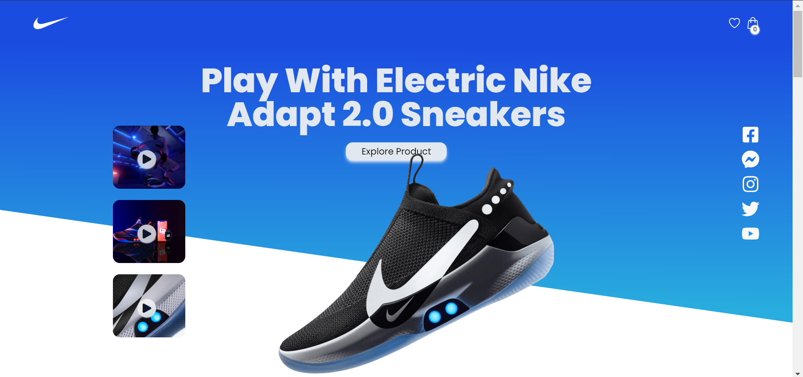
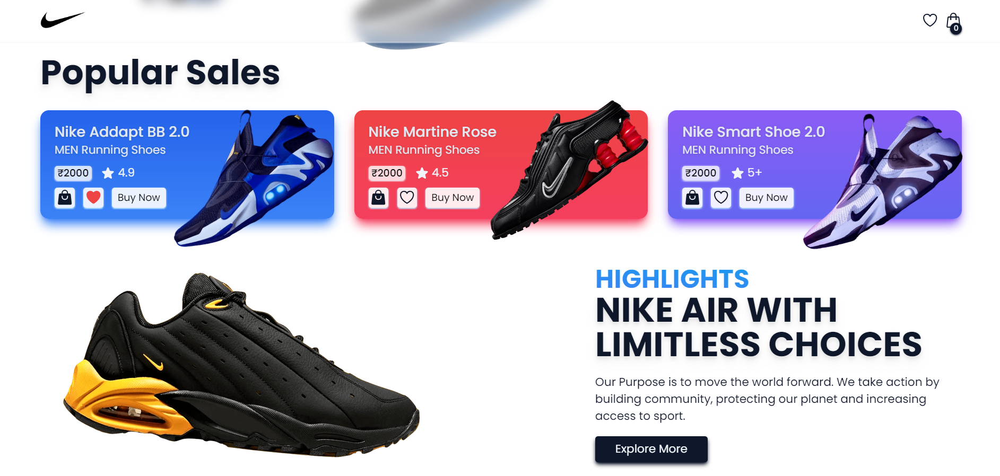
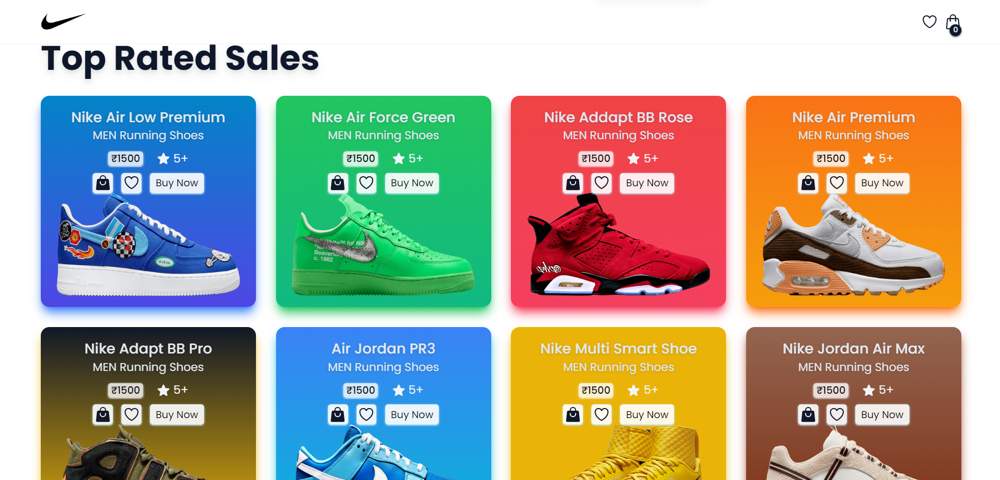
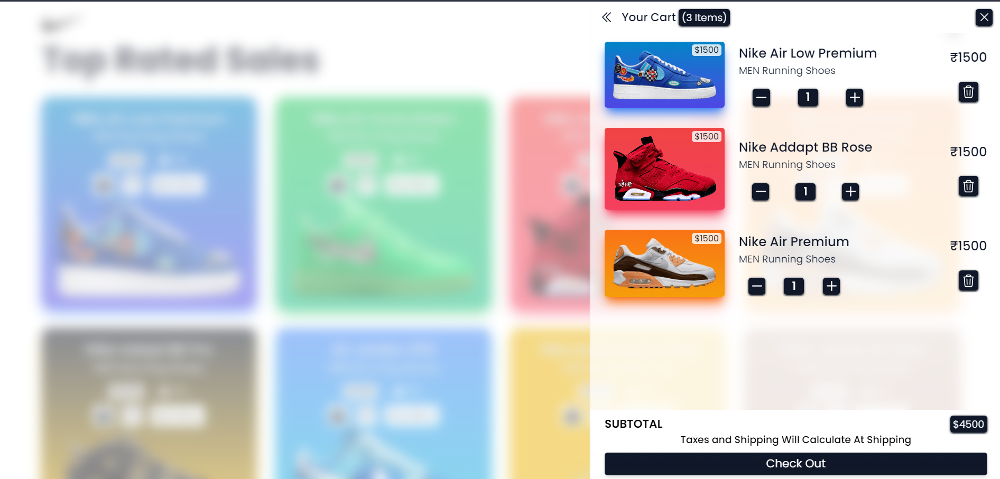

# Nike Store Ecommerce Web Application

Welcome to the Nike Store Commerce Web Application, a cutting-edge e-commerce platform designed with modern technologies to provide you with a seamless shopping experience. This project is built using [Vite.js](https://vitejs.dev/) and styled with the powerful [TailwindCSS](https://tailwindcss.com/).

## Live Demo

Check out the live demo of the Nike Store: [Nike Store Demo](https://aditya-nike-store.netlify.app/)

## Images






## Technologies Used

- [Vite.js](https://vitejs.dev/): A fast, opinionated web dev build tool that serves your code via native ES modules.
- [TailwindCSS](https://tailwindcss.com/): A utility-first CSS framework for rapidly building custom designs.
- [Redux Toolkit](https://redux-toolkit.js.org/): The official, opinionated, batteries-included toolset for efficient Redux development.
- [React-Redux](https://react-redux.js.org/): The official React bindings for Redux to manage the application state.
- [React-Hot-Toast](https://react-redux.js.org/): A declarative and customizable toast notification system for React.

## Features

- **Responsive Design:** Our Nike Store is built with a responsive design, ensuring a seamless and enjoyable experience across various devices.

- **Shopping Cart:** Easily add your favorite shoes to the cart, review your selections, and proceed to checkout.

- **Wishlist:** Create a wishlist of your desired shoes for future reference or purchase.

- **Product Details:** Dive into the details of each shoe, including specifications, pricing, and customer reviews.

## Getting Started

To explore the Nike Store locally, follow these simple steps:

1. Clone the repository:

```bash
git clone [repository_url]
cd [project_directory]
```

2. Install dependencies:

```bash
npm install
# or
yarn install
```

3. Start the development server:

```bash
npm run dev
# or
yarn dev
```

Now you can visit [http://localhost:3000](http://localhost:3000) in your browser to experience the Nike Store locally.

Feel free to explore, shop, and enjoy the modern and elegant design of our Nike Store Ecommerce Web Application! If you have any feedback or issues, please let us know. Happy shopping! 🛍️✨
